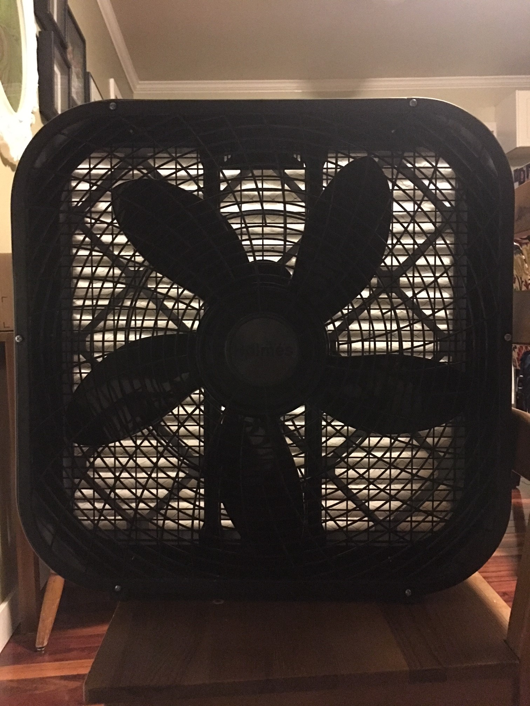
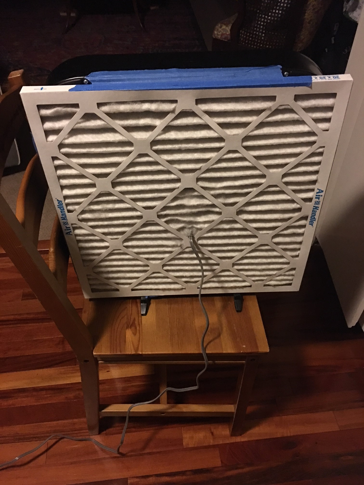
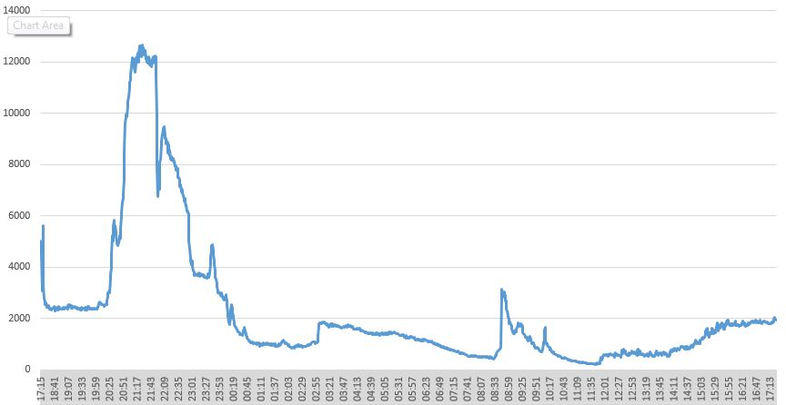
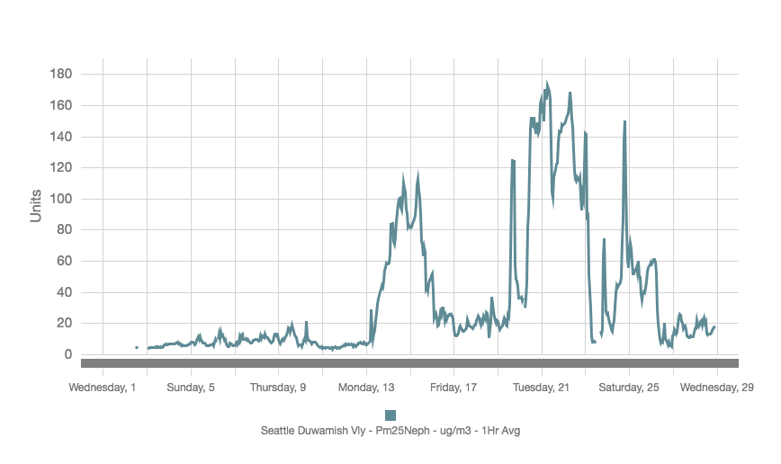

```{r knitr.global.options, include=F, eval=T}
knitr::opts_chunk$set(echo=F, 
                      warning=F, 
                      fig.align='center', 
                      fig.pos='H',
                      fig.width=12, 
                      fig.height=8, 
                      fig.path='Figs/', 
                      tidy.opts=list(width.cutoff=60),
                      tidy=TRUE)
options(scipen=999)
```

```{r load.packages, include=F, eval=T}
# Load pacman, installing as necessary.
my_repo <- 'http://cran.r-project.org'
if (!require("pacman")) {install.packages("pacman", repos = my_repo)}

# Load the other packages, installing as needed.
pacman::p_load(knitr, bookdown, dplyr, kableExtra, readxl, xlsx)
```

```{r upload.and.clean.data, include=F, eval=F}

## Read in real-time monitoring dataset

airdata <- read.xlsx("August2018Airpocalypse.xlsx", sheetIndex = 1)

<<<<<<< HEAD
test <- read.xlsx("August2018Airpocalypse.xlsx", sheetIndex = 1)


```

# Introduction

Wildfires in California, Oregon, Washington, and British Columbia resulted in several poor air quality days in recent summers. Previously, the term ["airpocalypse" has been used in the headlines](https://abcnews.go.com/International/460-million-chinese-residents-suffering-airpocalypse/story?id=44329107) to describe smog events around the world. In 2018, the Seattle Times ran a number of articles on the topic:

* [Aug 15: Seattle’s dirty air among world’s worst, but relief is in sight](https://www.seattletimes.com/seattle-news/weather/smoke-to-clear-up-from-seattle-skies-but-threatens-return-next-week/)
* [Aug 16: As smoke hangs over Northwest study shows air pollution was already high](https://www.seattletimes.com/seattle-news/environment/as-smoke-hangs-over-northwest-study-shows-air-pollution-was-already-high/)
* [Aug 19: Seattle pollution levels surge, as smoky air returns through at least Wednesday](https://www.seattletimes.com/seattle-news/environment/smoky-air-returns-to-seattle-through-at-least-wednesday/)
* [Aug 20: Washington's smoky air looks scary but UW physician says trust your body's defenses](https://www.seattletimes.com/seattle-news/health/washingtons-smoky-air-looks-scary-but-uw-physician-says-trust-your-bodys-defenses/)
* [Aug 22: Clean and green and good to go! Seattle air quality returns to normal](https://www.seattletimes.com/seattle-news/weather/seattle-weather-on-verge-of-major-shift-back-to-normal/)
* [Aug 25: Seattle's smoke is clearing. Now it's up to rain and wind to finish the job](https://www.seattletimes.com/seattle-news/changing-winds-bring-smoke-back-to-seattle-could-stay-through-sunday/)
* [Aug 27: Yes, we can do something about the wildfire smoke](https://www.seattletimes.com/opinion/yes-we-can-do-something-about-the-wildfire-smoke/) 

The [Puget Sound Clean Air Agency](https://www.pscleanair.org/35/About-Us) collects and provides data to protect public health, improve neighborhood air quality, and reduce the region’s contribution to climate change. According to their monitors (nephalometer), the highest particulates 

This report shares findings from an at-home experiment that utilized real-time particle counting with a ([Dylos Air Quality Monitor](http://www.dylosproducts.com/learnabout.html) to evaluate the impact of a [do-it-yourself (DIY) high-efficiency particulate air (HEPA) filter](https://www.king5.com/article/news/local/this-diy-air-filter-for-wildfire-smoke-is-less-than-20/281-584346009) described by the Puget Sound Clean Air Agency.

# Methods

(ref:airfilter-front) Front of filter. 

```{r airfilter-front, fig.cap='(ref:airfilter-front)', out.width='90%', echo=F}

```

(ref:airfilter-back) Back of filter. 

```{r airfilter-back, fig.cap='(ref:airfilter-back)', out.width='90%', echo=F}

```

# Results

(ref:time-series) Particle count time series for 0.5-1 micron bin. 

```{r time-series, fig.cap='(ref:time-series)', out.width='90%', echo=F}

```

\newpage

**TIME ACTIVITY PATTERN**

**WED (22 AUG 2018)**

* 17:15 - started monitor and brought it out to front yard for ~2 min
* 17:17 - sealed house
* 20:25 - brought monitor back out to front yard for ~ 2 min
* 20:30 - cooked dinner (1.5 hours)
* 22:00 - opened doors for 5 min
* 22:10 - sealed house and began running DIY HEPA filter in living room
* 23:30 - moved monitor and DIY HEPA filter to bedroom

**THU (23 AUG 2018)**

* 2:55  - one person got up for bathroom or checked on baby?
* 8:33  - moved monitor and DIY HEPA filter to living room
* 12:00 - opened doors and windows

(ref:pscaa) Local air data from August 2018. 

```{r pscaa, fig.cap='(ref:pscaa)', out.width='90%', echo=F}

```

# Discussion

\newpage

# Appendix

```{r table-airdata, include=T, eval=F}

kable(head(airdata, n=10), "latex", booktabs = T) %>% kable_styling(latex_options = "striped")
```
=======
>>>>>>> 1179267f32c3fd6e1d0a308150ec1e17fe687420
